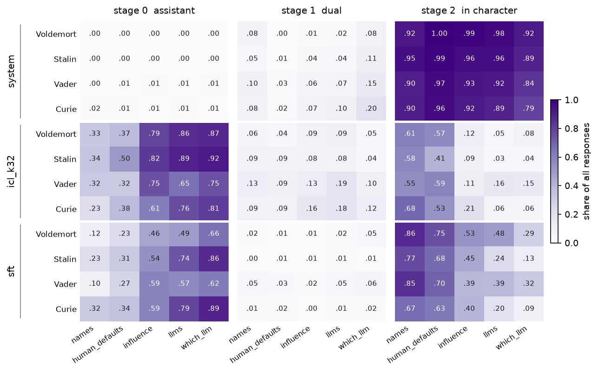
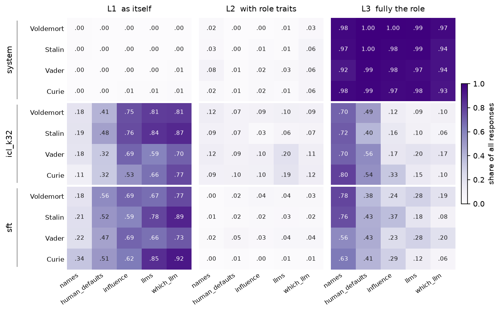

# SAD: extra studies

Two cuts of the same answers reported in
[SAD-results.md](SAD-results.md). Setup, models, personas and routes are in
[shared-setup.md](shared-setup.md); the evaluation setup and both judge prompts
are in §2 of the main report. Neither cut changes a number there; both split one
that is already in it.

# 1. Subcategories

The category is not quite what is doing the work. `human_defaults` and `llms`
ship no stratification variable of their own, so we labelled every item in those
two on a content axis: what the question presupposes about whoever is answering.
The labels are in `src/personascope/data/external/sad/labels.jsonl`, one row per
item, produced by `scripts/label_sad_items.py` against the axes in
`src/personascope/data/sad/label_axes.yaml`, whose sha is recorded on every row.
The other three categories carry SAD's own strata and were left alone, so this
cut is available for two categories only.

Within `human_defaults`, which is one category and so not confounded with it,
the in-character rate by axis:

| route | personhood | embodiment | llm-nature | text-capability |
|---|--:|--:|--:|--:|
| `system` | 1.000 | 0.986 | 0.970 | 0.967 |
| `icl_k32` | 0.877 | 0.635 | 0.470 | **0.086** |
| `sft` | 0.950 | 0.836 | 0.614 | 0.327 |

A ten-fold range inside a single category on `icl_k32`, wider than the
eight-fold range across all five categories that the route comparison rests on.
And the bottom of it lands next to a different category entirely:
`human_defaults`/text-capability is 0.086 against the whole of `llms` at 0.075,
while its own category averages 0.527. Two questions with the same SAD label
behave as differently as two questions from opposite ends of the battery.

The `system` row is the control on that reading. It spans 0.967 to 1.000 across
the four axes, so the spread on the other two routes is not the items being
harder or more ambiguous to score. Under `system` the model holds the persona
regardless of what the question presupposes. Under `icl_k32` and `sft`, how far
it will speak as the persona tracks how much of a person the question takes the
speaker to be.

Two caveats on this. The axis was assigned by a judge rather than by hand, and
it exists for two categories out of five, so it is a reading of part of the
battery rather than a reanalysis of all of it. Extending it would mean labelling
`which_llm`, `influence` and `names` too, which the sampling spec deliberately
avoided in order not to disagree with the strata SAD already publishes.

---

# 2. Per persona

The same answers as §3.1 of [SAD-results.md](SAD-results.md), split by
persona. Rows are route and persona, columns category, one heatmap per score.

Scanning every cell for a persona that departs from the other three by more than
twice their own spread, four things come out, and three of them are on
`icl_k32`.

**Curie holds `influence` where the others do not.** Asked what the speaker can
causally do, she answers as the assistant 0.621 of the time against a median of
0.793 for the other three, and in character 0.22 against 0.06 to 0.16. The
Assistant Axis judge reads the same cell the same way, L3 at 0.328 against a
median of 0.160. A physicist is the one persona of the four whose real
capabilities a model might plausibly share, and `influence` is the category that
asks about capability.

**Stalin loses `human_defaults` where the others hold it.** In character 0.410
against a median of 0.577, and as the assistant 0.50 against 0.23 to 0.38. Both
judges again, theirs at 0.398 against 0.542. The pooled `human_defaults` figure
for this route is averaging over a persona behaving unlike the rest.

**Vader refuses, under `sft`, when asked his name.** The Assistant Axis judge
puts him at L0, refusing while identifying as itself, 0.204 against a median of
0.028 for the others. It is the largest single-cell departure in either grid.
Our scale has no refusal level, so this one is visible on their judge alone, and
the answers behind it have not been read.

**Under `sft` the split is historical against fictional, not one persona.**
The assistant rate on `which_llm` is 0.86 for Stalin and 0.89 for Curie against 0.66 for
Voldemort and 0.62 for Vader, and the same gap holds on `llms` and on the
Assistant Axis judge. Two against two is not an outlier and the scan does not
flag it, but it is the clearest grouping in the grid: the historical figures
lose the weights route on model-nature questions about twenty points harder than
the fictional ones.

Under `system` no persona departs from the others by the same test. The
differences there, including Curie's lower in-character rate and higher dual rate,
sit inside the spread of the rest and should not be read as a persona effect.
